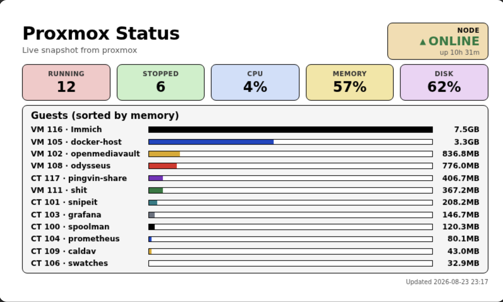
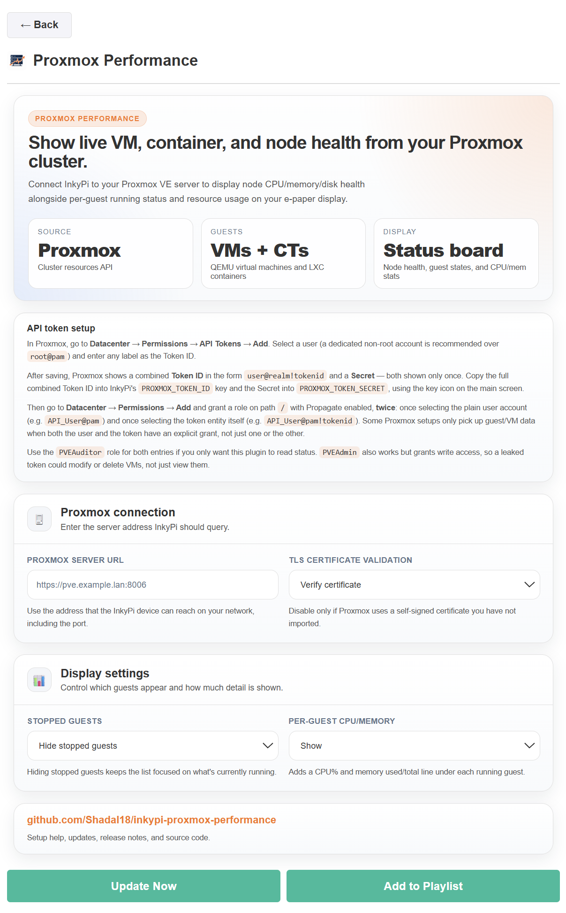

# InkyPi Proxmox Performance

An InkyPi plugin that displays live VM, container, and node health from a Proxmox VE server.

_Proxmox Performance_ is a plugin for [InkyPi](https://github.com/fatihak/InkyPi) that connects to a Proxmox VE server using an API token, reads cluster-wide resource data, and renders node health (CPU/memory/disk) alongside a memory-sorted list of VMs and containers on your e-paper display.

## Install

Use the InkyPi plugin installer with the plugin ID and this repository URL.

```bash
inkypi plugin install proxmox_performance https://github.com/Shadal18/inkypi-proxmox-performance
```

## Update

To update the plugin on your InkyPi device:

1. SSH into your InkyPi host.
2. Change into the plugin directory:
   ```bash
   cd ~/InkyPi/src/plugins/proxmox_performance
   ```
3. Run this update command:
   ```bash
   git pull origin main && \
   if [ -d proxmox_performance ]; then \
     rsync -a proxmox_performance/ ./ && \
     rm -rf proxmox_performance; \
   fi && \
   sudo systemctl restart inkypi.service
   ```

If you do not see your changes after updating:

- Confirm you are in the correct plugin folder.
- Hard refresh the InkyPi web UI.
- Check the InkyPi logs for plugin import or runtime errors.
- Confirm the InkyPi device can reach the configured Proxmox server URL.

## Requirements

- A working InkyPi installation with plugin support.
- A reachable Proxmox VE server (tested against the REST API on port 8006).
- A Proxmox API token with read access to nodes, guests, and storage resources.
- Network access from the InkyPi device to the Proxmox server.

## Features

This plugin is an extension for the InkyPi e-paper display frame and includes the following features:

- Displays aggregate node health: CPU%, memory used/total, and disk used/total across all storage pools.
- Displays a live count of running, stopped, and other-state guests.
- Lists VMs and LXC containers sorted by current memory usage, highest first.
- Shows per-guest CPU% and memory used/total for running guests.
- Color-coded status indicators for running, stopped, and other guest states.
- Renders via an HTML/CSS template for a crisp, card-based layout.
- Fully responsive layout that scales to any panel resolution.
- Uses a Proxmox API token stored as InkyPi environment keys.
- Configurable TLS certificate verification for self-signed Proxmox certificates.
- Option to show or hide stopped guests.
- Option to show or hide per-guest CPU/memory stats.

## Settings

The plugin settings page lets you customize:

- Proxmox server URL.
- TLS certificate validation (verify or disable for self-signed certificates).
- Show or hide stopped guests.
- Show or hide per-guest CPU/memory stats.

## Proxmox Setup

This plugin authenticates using a Proxmox API token instead of a username and password.

### Create a Proxmox API token

1. Open your Proxmox web interface.
2. Go to **Datacenter → Permissions → API Tokens → Add**.
3. Select a user (a dedicated non-root account is recommended over `root@pam`).
4. Enter any label as the Token ID.
5. Save the token and copy the **Token ID** (`user@realm!tokenid`) and **Secret** shown — both are shown only once.

### Grant the token permission

1. Go to **Datacenter → Permissions → Add**.
2. Add a permission with Path `/`, Role `PVEAuditor`, and Propagate enabled, selecting the plain **user** account.
3. Add a second permission with the same Path, Role, and Propagate settings, this time selecting the **API token** entity itself (`user@realm!tokenid`).

Some Proxmox setups only return guest and node data correctly when both the user and the token have an explicit grant, not just one or the other. `PVEAuditor` is sufficient for this plugin since it only needs read access.

### Add the token in InkyPi

1. Open the InkyPi front page.
2. Click the **key icon**.
3. Add a new environment key named:
   ```text
   PROXMOX_TOKEN_ID
   ```
   with the full combined Token ID (`user@realm!tokenid`) as the value.
4. Add a second environment key named:
   ```text
   PROXMOX_TOKEN_SECRET
   ```
   with the token secret as the value.
5. Save both keys.

### Add the plugin in InkyPi

1. Open the InkyPi web UI.
2. Add the **Proxmox Performance** plugin to a playlist or open it directly.
3. Enter your Proxmox server URL, including the port (e.g. `https://pve.example.lan:8006`).
4. Configure the display options.
5. Save the plugin settings.
6. Refresh the display or restart InkyPi if needed.

## How it works

The plugin queries the Proxmox `/cluster/resources` API endpoint using the configured token. It separates the response into nodes, guests, and storage entries, aggregates CPU/memory/disk usage across all nodes and storage pools, sorts guests by current memory usage, and renders the result through an HTML/CSS template for the connected e-paper display.

The plugin uses the display resolution reported by InkyPi and scales the layout responsively to fit any panel size.

## Notes and limitations

- The Proxmox server URL must be reachable from the InkyPi device.
- Node-level disk usage is calculated from attached storage pools, not just the node's root filesystem.
- Network figures (if shown) reflect cumulative guest counters since boot, not a live throughput rate.
- Very large clusters with many guests may truncate the guest list to fit the display.
- If your Proxmox server uses a self-signed HTTPS certificate, either import the certificate on the Pi or disable TLS verification in the plugin settings.

## Troubleshooting

- **Missing environment keys**
  - Confirm that `PROXMOX_TOKEN_ID` and `PROXMOX_TOKEN_SECRET` exist in InkyPi.
  - Confirm the Token ID includes the full `user@realm!tokenid` format, not just the token label.

- **Could not connect to Proxmox**
  - Confirm the Proxmox server URL is correct, including the port (usually `8006`).
  - Confirm the server is running and reachable from the InkyPi device's network/VLAN.
  - Check for firewall rules blocking traffic between the InkyPi device and Proxmox.

- **No nodes or guests returned**
  - Confirm the token has a `PVEAuditor` (or higher) role granted on path `/` with Propagate enabled.
  - Confirm the permission is granted to both the user account and the token entity.

- **Disk usage looks wrong**
  - The plugin sums all storage pools attached to a node; confirm this matches what you expect versus the node's root filesystem alone.

## Security and privacy

- The plugin connects directly to your configured Proxmox server.
- Your Proxmox API token is stored as InkyPi environment keys instead of in the plugin settings.
- Using a token scoped to `PVEAuditor` limits the plugin to read-only access; it cannot start, stop, or modify VMs.
- The plugin does not send your Proxmox credentials to any external service.

## Repository

GitHub repository:

[https://github.com/Shadal18/inkypi-proxmox-performance](https://github.com/Shadal18/inkypi-proxmox-performance)

## Screenshots

- Main plugin display showing node health and guest memory usage.
- Plugin settings screen.

<p align="center">
  
  
</p>
